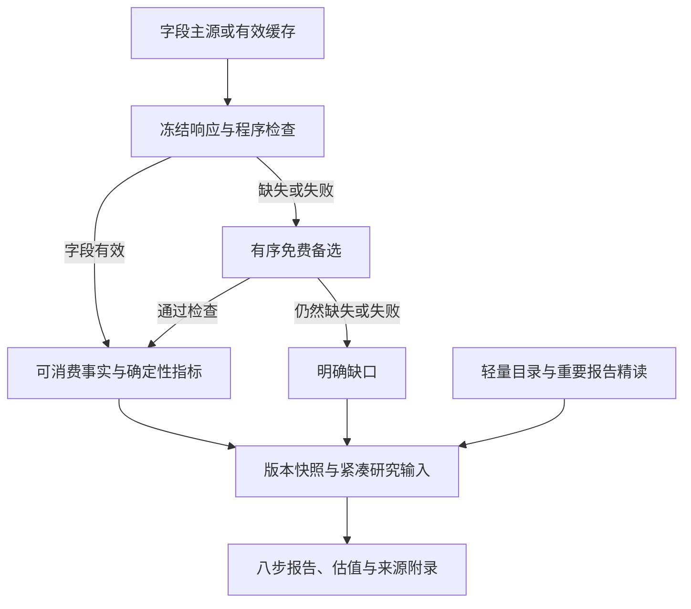

# A 股八步财报分析系统——全量研究数据层实施计划

> 文档状态：目标方案 v2.1，实际接口字段、首批同行和精读默认规则已选定，待软件实施
>
> 更新日期：2026-09-08；v1.0 制定于 2026-09-03，其内容由 Git 历史保留
>
> 上位方案：[计划.md](./计划.md)；来源规则：[evidence_policy.md](./docs/methodology/evidence_policy.md)
>
> 实施附录：[字段、首批同行与精读规则 v1](./docs/acquisition/structured-data-field-plan-v1.md)；[完整返回字段清单](./docs/acquisition/structured-data-interface-fields-v1.json)
>
> 本次范围：调整实施文档，不修改运行配置、源码、数据库、已交付 OpenSpec 或历史验收结论
>
> 当前决策：结构化数据优先、重要报告精读；首版覆盖目标公司及同行，逐步扩展

## 1. 已确认的目标与边界

数据流程调整为：

1. 东方财富为公司结构化数据主要来源；BaoStock 提供日行情、估值及其实际覆盖、口径明确的常见财务指标。具体字段只有一个主要来源。
2. 取得研究对象适用且能够长期免费获取的全部一类数据，不缩成固定少量核心字段。全量是目标公司及同行适用字段与供应商可免费提供的全部历史记录覆盖，不是默认建设全 A 股数据库；首次分批入库，之后只做增量更新。
3. 主源成功即使用；缺失、接口失败或响应校验失败才补源，取消默认双源对账、PDF 逐项核验和主动追查每个正式更正版本。
4. 供应商结构化数据可以直接进入分析，不能因缺少正式披露主源而被标为不可使用。
5. 公告保留轻量目录；完整中文年报、中报精读；季报主要更新数据，明显变化时定向阅读；重大事件和更正公告按问题触发精读。
6. 独立审计 PDF、英文年报继续停采正文，重复内容复用。保留已有原文与解析结果，不为转换方案重抓已有材料。
7. 财务随报告更新、行情按日更新、股东和资本动作按事件更新、行业变量按需加载。
8. 允许注册免费账号或 API Key；限时试用、必须付费才能持续取得所需数据的服务不作为必需依赖。

本轮不改研究评级、预测假设确认等报告层决策，不填写未完成的方法正文，不将旧业务采集样本验收解释为八步研究能力全部完成。

## 2. 历史基线与目标差异

2026-09-03 的 v1.0 基线主要围绕正式披露抽取、双源核验和全公告正文归档。当时的样本条数、测试数和接口覆盖属于历史记录，不作为当前覆盖承诺。

当前主仓的 [阶段日志](./阶段日志.md) 已记录商业模式采集恢复、两次增量与生产终验，其证明范围仍限于对应代码、注册表、公司和截止时点。本方案沿用已建设的通用能力，不重复已完成的线上恢复。

| 对象 | 保留 | 待新软件变更调整 |
|---|---|---|
| 采集控制面 | 缓存、分页、去重、限速、重试、增量、恢复、访问观测 | 接入供应商数据集与字段路由，避免主源成功后仍双抓 |
| 原始证据 | 响应/文档哈希、快照、已有正文及解析 | 支持响应行键/字段路径，取消供应商事实的 PDF 页码必填 |
| 来源策略与事实状态 | 旧来源、对账记录、旧快照语义 | 修改 source_policy、可消费选择器和状态映射 |
| 公告 | 目录、分类、历史 HTML、附件复用、停采规则 | 分开目录覆盖与重要正文选择，不把未选正文当采集失败 |
| 定性分析 | 主题与章节路由、带出处事实、紧凑材料包 | 结构化字段先供给，重要报告负责解释与补充 |
| 报告 | 事实/公式/假设引用、版本、导出一致性 | 接受供应商直采，不要求假标为双源一致 |

旧 [business-model-acquisition-v1](./openspec/changes/business-model-acquisition-v1)、[目录恢复变更](./openspec/changes/business-model-directory-recovery-v1) 和 [治理 v1](./openspec/changes/governance-management-data-foundation-v1) 的 artifacts、勾选和验收历史本轮不改写。新行为依据已选定的字段附录，由独立 OpenSpec 约定迁移与兼容边界。

## 3. “一类数据”和“全部获取”的操作定义

### 3.1 数据性质按字段判定

| 数据性质 | 示例 | 保存与使用 |
|---|---|---|
| 已披露或已记录的客观事实 | 三表科目、股数、分红实施金额、成交价、审计意见类型 | 指定供应商字段通过程序检查后直接消费 |
| 公式明确的确定性指标 | 同比、毛利率、ROE、PE TTM、PB、商誉/净资产 | 保存定义和原始值；本地计算保存输入与公式版本，不需默认复算供应商所有指标 |
| 覆盖不足或含模型假设的估计 | 不完整公司样本算出的 CR5、模型估值、算法“主力净流入” | 独立标为估计或供应商算法指标，不能冒充实测事实 |
| 平台标签 | 概念题材、平台行业标签、平台选取的同行 | 保存平台、分类版本和日期；标签本身可追溯，但不证明业务贡献或可比性 |
| 预测、指引和观点 | 券商 EPS 预测、评级、市场观点、公司未来业绩指引 | 保存作者/机构、发布时间、预测期和快照，独立于历史实际值 |
| 分析判断 | 竞争优势、治理质量、未来商誉减值风险 | 由 Codex 基于实际读取证据形成，保留依据，不写回客观事实 |

确定性计算并不等于主观推断；但公式依赖未来假设、未知分母或覆盖不全时，不能只凭计算程序确定就称为客观事实。供应商的栏目名称也不能决定整栏的数据性质。

### 3.2 覆盖清单与缺口

- 建立适用的数据集与字段清单：字段名、定义、是否适用于目标及同行、实际接口、主要来源、备选、覆盖时间、分页方式、更新节奏、状态。
- 同一接口返回的适用客观字段均登记；暂未映射字段保留原始响应并列入待归类清单，不能静默丢弃。未知字段未归类前不作为确定性输入。
- 分页/游标必须走完并保存终页依据、总数与实收数。按公司过滤、日期分段与限量接口的截断必须可检测；样本、前 500 行或前 N 页不代表完成。
- “应取”“已取”“通过检查”“缺失/失败”“待归类”“不适用”“按策略未取正文”分别统计，恢复、去重、汇总等读取路径也必须覆盖全部分页。
- 首次历史范围已确认采用供应商可免费提供的全部历史，按数据集分批入库；记录真实最早/最晚时间、断档及可得性限制。源只覆盖部分历史不等于公司更早没有记录；默认五年/十二季度展示不截断历史获取。
- 接口返回空表只能证明本次查询无记录；必须同时验证响应结构、总数/终页等接口合同。不能推出公司没有历史公告、处罚、诉讼或其他事项。

## 4. 来源路由与接入资格

| 来源 | 目标职责 | 使用边界 |
|---|---|---|
| 东方财富 | 三表明细、公司与业务、股东、资本动作及其他客观结构化数据 | 首要公司数据源；公开接口覆盖逐项登记，网页可见不等于接口已验证 |
| BaoStock | 日 K、日估值、实际覆盖的常见季度财务指标、必要的交易基础数据 | 免费匿名接入；不把其有限财务指标集当成完整三表 |
| 其他免费数据源 | 主要来源缺失/失败的备用，以及主源不覆盖的行业等类别 | 每字段指定有序备选；行业专属变量可独立指定一个合适主源 |
| 巨潮及交易所 | 轻量公告目录、重要报告正文、具体缺口的正式资料 | 巨潮主采、交易所按需补缺；不作为所有结构化事实的统一消费门禁 |
| 政府、协会、商品交易所等 | 按需行业、宏观、利率、商品和监管数据 | 单一主要来源与定义登记，不要求默认第二统计体系复核 |
| AKShare、efinance 等工具 | 封装上述真实上游接口 | 不是独立供应商；两种工具调用东方财富不能算两个来源 |
| 资讯与预测平台 | 免费预测、公司指引、资讯和市场预期发现 | 与客观事实分层保存；不优先依赖付费一致预期 |

路由顺序：先使用满足新鲜度要求的有效缓存，否则请求该字段主源；主源缺失或失败时，仅对未成功范围依次尝试备选。记录 `fallback_reason` 和实际来源。备选同样失败时保留明确缺口，或显式使用已过期缓存；不无限重试、不以静默旧值冒充最新值、不自动重新遍历 PDF。

一份响应可能含多个字段：保留完整原始响应，但只提升通过相应字段检查的数据；其他字段走缺口处理，不能因一个字段为空重抓整批成功字段。共享接口调用应合并并缓存。

### 4.1 调研依据与验证边界

2026-09-08 的字段调研完成东方财富 45 个和 BaoStock 10 个数据集的小样本取数，共登记 2,487 个“数据集—字段”位置；数字包含元数据、重复语义、空字段、文本及非事实字段，不是独立有效指标数。七家公司共同期间的主营查询返回 72/72 行并到终页。字段、参数和证据摘要已写入实施附录；尚未执行七家全历史归档、备选源联网验收或 PDF 对账。

- [AKShare 股票接口文档](https://akshare.akfamily.xyz/data/stock/stock.html)：用于定位实际上游、可用字段和调用方法。
- [BaoStock 官方介绍](https://www.baostock.com/mainContent?file=home.md)：免费开源；各数据集历史边界分别登记，不能用日 K 历史覆盖推断财务覆盖。
- [同花顺 Financial-API](https://github.com/HiThink-Tech/Financial-API)：需 Key；长期免费与具体费用尚未确认，暂不设为必需源。
- [聚宽 JQData 说明](https://www.joinquant.com/help/api/doc?name=logon&id=9830)：已查到的免费试用和近端历史限制不满足本方案的长期免费要求。
- [Tushare 积分说明](https://tushare.pro/document/1?doc_id=108)：主要财务接口存在积分门槛，不作为默认免门槛来源。
- [债券](https://akshare.akfamily.xyz/data/bond/bond.html)、[宏观](https://akshare.akfamily.xyz/data/macro/macro.html)、[利率](https://akshare.akfamily.xyz/data/interest_rate/interest_rate.html)、[现货](https://akshare.akfamily.xyz/data/spot/spot.html)文档支持按需扩展，具体接口仍需验证。

## 5. 数据类别—字段—来源—更新—精读对应表（已选定范围概览）

**实际接口、原字段、主路由、七家公司名单、更新安排及 R01–R12 精读规则已在 [实施附录 v1](./docs/acquisition/structured-data-field-plan-v1.md) 选定。** 下表是类别概览，实际已核实字段与尚无接口证明的细项以附录为准，不是穷尽白名单。全部适用字段与供应商可得全历史首次分批、之后增量；接口新增字段继续登记。日行情默认每交易日 19:00，事件及目录每日 20:30（北京时间）；这只是目标调度，尚未部署任务。

| 数据类别 | 具体字段范围或示例 | 已选主要来源或明确缺口 | 更新频率 | 是否需要精读 |
|---|---|---|---|---|
| 公司基础 | 名称、代码、上市日期、注册地、资本、经营范围、官网等适用主档字段 | 东方财富 | 首次及变更 | 基础字段否；宣传性描述不归事实 |
| 证券与交易基础 | 证券代码映射、交易日历、交易/停牌、ST/退市等实际覆盖状态 | BaoStock | 首次及变更，交易状态按日 | 否 |
| 财务三表 | 默认上市公司三表全部适用科目、报告期及发布日期；母公司单体仍留独立范围缺口 | 东方财富 F01–F04 | 随报告更新 | 数据不逐项核 PDF；年报/中报另行精读 |
| 常见财务指标 | EPS、ROE、利润率、成长、周转、偿债、现金流指标，按实际覆盖与定义拆分 | BaoStock 已覆盖字段 | 随报告更新 | 否，明显变化时定向阅读 |
| 财务扩展指标 | BaoStock 未覆盖的指标、扣非、每股数据、资产质量与附注摘要字段 | 东方财富 | 随报告更新 | 定义缺失先留缺口；解释按需 |
| 主营与业务拆分 | 分产品/地区/行业的收入、成本、毛利、占比；分类名称及期间 | 东方财富 | 随年报/中报 | 是，结合经营讨论理解业务与分类变化 |
| 经营补充 | 客户/供应商、研发、员工、人均及控参股企业；产销、产能、渠道库存等细项仍留缺口 | 东方财富 C03–C07；未取得稳定免费字段的细项按附录 2.5 处理 | 随报告或经营公告 | 是，重要报告补充未结构化细节 |
| 商誉与减值 | 商誉余额、减值额、占净资产比例、资产减值科目 | 东方财富 | 随报告与减值事件 | 数值直接用；资产组与未来风险按问题读附注 |
| 股本与股东 | 总/流通股本、十大股东/流通股东、股东户数、实控人及持股 | 东方财富 | 报告期快照及事件 | 否；控制链不清或变化时定向阅读 |
| 质押与解禁 | 质押/解押日期、股数、主体、比例基数、限售解禁计划和实际状态 | 东方财富 | 按事件 | 重大或状态不明时按需 |
| 管理层、薪酬与激励 | 人员、职务、持股、薪酬、实际返回的任期字段；完整历史离任及激励条款留缺口 | 东方财富 G06–G08；未结构化条款按问题补充 | 随报告及事件 | 考核条款、履历含义等按需 |
| 治理与客观风险事件 | 担保、诉讼、处罚、审计机构及意见；全面关联交易、承诺和整改细项留缺口 | 东方财富 G09–G11、C01/F01；细项不以关联担保冒充全面覆盖 | 随报告及事件 | 重大事件及条款按需；不采独立审计 PDF |
| 分红与送转 | 每股方案、股数基数、现金额、登记/除权/支付日、预案/实施状态 | 东方财富 | 按事件 | 通常否；特殊安排按需 |
| 回购与增减持 | 主体、数量、金额、价格、用途、开始/结束日、计划/进展/完成 | 东方财富 | 按事件 | 重大或用途不明时按需 |
| 融资与并购 | 增发、配股、募资及项目字段；全面并购对价与业绩承诺状态留缺口 | 东方财富 A03/A07/A08；并购细项按问题补充 | 按事件 | 并购、重大融资等按问题触发 |
| 债券与可转债 | 发行额、票息、起息/到期日、初始转股价；实时余额与完整转股/赎回生命周期留缺口 | 东方财富 A04 | 按事件 | 关键条款或偿付问题按需 |
| 日行情 | 开高低收、昨收、成交量/额、换手、停牌、复权标识及可用复权数据 | BaoStock | 每交易日收盘后 | 否 |
| 日估值 | PE TTM、PB MRQ、PS TTM、现金流量净额口径 PCF TTM | BaoStock B01 | 每交易日收盘后 | 否；PCF 不混成经营现金流口径 |
| 估值扩展 | 总/流通市值、BaoStock 未覆盖且定义明确的估值字段 | 东方财富 | 每交易日收盘后 | 否；缺乏历史版本证明不充当严格 PIT 输入 |
| 交易与持仓补充 | 融资融券、大宗交易、龙虎榜实际成交、基金披露持仓、机构调研日期/参与方 | 东方财富 | 交易类按日，持仓随披露，调研按事件 | 通常否；调研内容按问题读取 |
| 行业分类与同行集合 | 分类标签及版本、七家公司名单与业务依据、同行财务与估值 | 东方财富 L01/C02；同行字段沿用各自已指定主源 | 分类/业务变化后形成新集合版本 | 茅台为目标；五粮液、泸州老窖为核心，汾酒、洋河、古井、今世缘用于经营比较 |
| 行业、宏观与利率 | CPI、社零、国债曲线；白酒产销/批价/库存等仍留缺口 | 东方财富 I01/I02 已实测；中债接口已定位、联网待首次需要时验证 | 按研究需要加载，随后随发布更新 | 宏观统计不替代白酒行业量价 |
| 概念与题材标签（独立层） | 平台概念名、成员、分类时间 | 东方财富等选定标签源 | 研究触发及标签变化 | 验证业务重要性时读主营；标签不当经营事实 |
| 资讯、预测与观点（独立层） | 作者/机构、日期、标题、事件线索、预测期/EPS/评级、平台汇总口径 | 可长期免费取得的东方财富等来源 | 研究触发及事件 | 不默认获取全部研报；按问题阅读相关内容 |
| 公告轻量目录 | 公告 ID、标题、日期、类别、链接、关联信息、正文选择状态 | 巨潮；目录缺口时交易所备选 | 增量更新 | 目录本身否 |
| 重要报告正文 | 完整中文年报、中报；触发的季报、重大事件与更正公告 | 巨潮已有归档或原链接；缺口时免费备选 | 随报告或问题触发 | 按选择规则精读并保留章节/页码 |

已定位的主源和备选见附录；无稳定免费接口证明的细项按明确缺口处理，不能发布含模糊主源的生产路由或称该细项已经覆盖。日行情的东方财富备选和三表的新浪备选只在主源实际失败/缺失时验证并调用。某类文档或接口不可得时，不为表格填满而引入付费或推断数据。

软件实施依据附录建立标准字段 ID、原字段及接口、数据性质、期间类型、单位/币种、合并范围、公式/定义、时间字段、实际历史边界、主源、备选与触发条件、新鲜度和检查规则。返回字段 JSON 是实测结构证据，不是运行配置；尚未明确含义的字段保留原始命名空间并登记，不假称全部 2,487 个字段都已完成语义映射。

## 6. 整理与可消费规则

### 6.1 标准化

- 流量按定义处理年度、累计、单季和 TTM；累计转单季需要同年同范围可比输入，TTM 需要连续且同口径期间。资产负债表存量按时点保存，不按流量相减/相加。
- 保留供应商原始标签和值，转换后记录标准单位、币种、合并范围和转换方法；比率的百分数与小数不得混用。
- 毛利率、ROE、EPS、PE、股息率等按来源定义登记。无法确定核心含义的字段保留原值但暂不用于相关精确比较；不因此要求所有字段去找正式 PDF。
- 日期区分报告期、披露日、生效日、交易日、获取时间。预案/实施、计划/完成分别保存，不能因有金额就当成已经发生。
- 主营分类、行业标准、同行集合和指标定义变化形成新版本，旧期间不静默拼接。

### 6.2 质量检查与降级

- 空值、空结果、重复键、分页截断、日期越界、单位跳变、适用的勾稽与明显异常分别检测。
- 只在字段完整且口径相同时检查资产负债恒等式、现金流衔接、分部合计等；允许对应精度，不能把亏损或负值统一判为异常。
- 主源有效字段直接消费；响应校验失败按具体字段/数据集进入备选。检查阈值、关键字段与部分可用边界在新合同中冻结。
- 备选获得新值也记录来源；如自然观察到不同版本或重大矛盾，保留差异、不平均，限制受影响输入，不组织默认第二轮对账。
- 将“未披露”“暂无该数据”“不适用”与查询失败分开；没有接口字段或空结果不能自动归为未披露。

### 6.3 事实状态与历史使用

“供应商直采且可消费”不依赖正式来源或双源。目标应分开表达取得方式、数据性质、质量/可消费性和版本血缘，具体枚举与旧状态兼容由新 OpenSpec 定义。

- 旧 `双源一致`、`权威单源` 等状态保持历史含义；新供应商事实不伪标为完成原文核验。
- 接口观测以响应快照、分页、行键和字段路径定位；重要报告以页码/表格/段落定位；确定性派生以输入事实和公式定位。
- 当前供应商历史序列可用于当前分析，包括日估值和历史趋势；无历史版本证明时注明它是供应商当前提供的历史序列。
- 只有能够证明当时版本与可得时间的记录才能进入严格 point-in-time 回放。缺证明不阻断当前研究，也不自动追加全历史 PDF 核验任务。
- 供应商重发或更新已有期间时按响应快照保存新版本；已知修订链用于版本选择。无需主动追找全部正式更正，旧报告/快照不改写。

## 7. 公告目录、重要报告与定性研究

### 7.1 正文选择

| 材料 | 默认动作 | 精读重点或触发条件 |
|---|---|---|
| 完整中文年报、中报 | 获取或复用正文与解析 | 经营讨论、分部与渠道、关键附注；按主题路由阅读 |
| 季报 | 更新结构化数据及目录 | 明显变化且需要解释时获取/读取相关章节 |
| 重大事件、更正公告 | 目录召回、保存已知关联 | 并购、减值、融资、控制权变化或正在研究的具体问题触发 |
| 其他公告 | 轻量目录 | 只有与具体研究问题相关时获取正文 |
| 独立审计 PDF、英文年报 | 仅元数据，正文停采 | 审计机构/意见等字段从结构化数据或中文年报取得 |
| 已确认同一内容的不同 URL/附件 | 复用内容与解析 | 保留来源观测；新附件获取后发现同哈希时不重复存储或解析 |

按策略未选正文与网络失败是不同状态，不应制造全量归档屏障。目录查询真实失败仍保留 coverage 和恢复状态，不能借正文停采掩盖目录缺口。

### 7.2 解析与分析输入

- 复用现有 PDF/历史 HTML 处理与 MinerU 精准解析 API，保留哈希、原文、页码和解析版本；识别拦截页，不恢复旧本地 OCR。
- 先向 Codex 提供结构化字段、事件状态、主题—章节对应关系和缺口摘要；按问题查询明细，不把已抓全部字段与所有全文装入上下文。
- 精读解释业务模式、竞争力、资产组、渠道、承诺和风险；关键结论有章节或事实引用。成功解析、主题路由或候选抽取不能冒充人工确认。
- 结构化字段已足够回答的问题直接使用，不重复从报告抽取同一数值。需要的新增客观事实保持字段级证据；不把分析判断回写客观记录。

## 8. 数据对象、报告和查询接入

复用现有 SourceRecord、FactRecord、VerificationRecord、EventRecord、维度事实、预测/同行版本及快照能力。实施前逐项核实实际存在的模型，避免重新创建已经交付的对象。

| 数据合同 | 目标调整 |
|---|---|
| 来源/字段注册 | 明确主要来源、备选顺序、真实上游、免费范围、覆盖、速率、新鲜度和策略版本 |
| 原始响应与观测 | URL/接口、脱敏参数、获取时间、hash、页/游标、总数和终页证明 |
| 事实/维度事实 | 支持结构化字段定位、定义与期间、取得方式、性质、质量状态，不强制 PDF 外键 |
| 事件 | 供应商事件直接映射；保留 root/event ID、披露日、生效日和状态，已知更新形成版本 |
| 行业事实 | 固定产品/区域/分类、统计期、覆盖和分母；不完整样本 CR3/CR5 单列估计 |
| 预测与观点 | 作者/机构、发布时间、预测期、样本口径和快照；与实际值分离 |
| 同行集合 | 平台候选加业务可比性选择，保存纳入/排除理由和版本 |
| 报告输入 | 只读相关事实与章节；缺口不造值，旧报告保持原来源策略版本 |

同步入口按公司集合、数据类别和策略版本运行；财务、市场、股东资本事件、行业与正文可独立恢复。血缘查询同时支持响应字段、文档位置和公式，报告和所有导出消费同一规范结果。

治理方案的来源准入也按本方案调整，见 [治理与管理层数据采集底座实施方案](./治理与管理层数据采集底座实施方案.md)；其人员身份、任期、双时点、快照和报告框架继续保留。治理自主报告与总方案的用户确认差异属于已有独立决策，不在本次获取策略中顺带改变。

## 9. 更新、缓存与恢复

- 首次基线：按目标公司及同行、数据集和来源可得历史分批入库，保留各批覆盖与恢复位置；完成后只增量取得新期间、新事件及供应商暴露的更新，不默认重跑全历史。
- 财务：按报告期更新主源字段，保留本次响应版本；合理复用成功缓存，不逐日全量重抓所有报表。
- 日行情/估值：按交易日增量，区分非交易日、停牌、合法空值和失败；记录时间及数据延迟。
- 股东/资本动作：依据新报告和事件刷新，保留披露/生效双日期与生命周期；默认每日 20:30，未完成事项继续刷新，无更新标记时采用 30 日重叠窗口与去重。
- 公告：保持轻量目录增量和失败恢复；正文仅对策略选中项排队。
- 行业：研究需要时加载所选变量，按其发布频率更新，缓存可复用到同行。
- 所有路径复用限速、分页、重试、去重和 checkpoint；路由、字段语义或正文策略变化需明确版本边界，不得误用旧 scope 的覆盖证明。
- 实际访问限制与服务故障记录为对应状态；主源缺口按已登记备选处理，不无限重试或绕过访问控制。

## 10. 待实施顺序

| 阶段 | 工作 | 退出条件 |
|---|---|---|
| P0 新软件合同 | 字段、首批同行和精读规则已选定；依实施附录创建独立 OpenSpec，冻结字段语义映射、迁移、调度和验收边界 | 每标准字段只有一个主源，未知字段/缺口显式登记，试用源不混入必需依赖 |
| P1 来源策略与状态迁移 | 调整 source_policy、事实状态、消费选择器、API/导出；保留旧语义与快照 | 仅有供应商结构化数据的有效字段可被消费，无需伪造正式源或双源状态 |
| P2 主源接入与全量字段登记 | 按研究对象分批取得适用接口全部可得历史、全分页、原始响应与字段映射，接入有序备用 | 对选定范围出具真实覆盖和缺口清单，主源成功无备选请求 |
| P3 更新与恢复接续 | 按财务/日行情/事件/按需行业分别更新，验证缓存、重试、去重和续跑 | 不漏页、不丢失败，重复运行不产生重复事实，不重抓成功范围 |
| P4 重要报告与研究输入 | 轻量目录、正文选择、MinerU 复用、主题章节和结构化事实接入 | 年报/中报可精读，触发式正文有理由，停采内容不抓不解析 |
| P5 联网与消费验收 | 目标公司及同行真实运行、报告/导出检查、开发期人工抽样 | 三类验收分别记录范围与结果，旧报告兼容，待验证类别如实保留 |

P0 的方案输入和 OpenSpec `structured-data-first-v1` 已建立；2026-09-08 已在独立分支启动 P1–P5 的软件实施与隔离样本验证，实际完成项以该变更的任务清单和阶段日志为准。该分支尚未合并或部署，七家公司全历史生产归档、两次生产增量和本方案人工验收仍未执行。

## 11. 测试与验收

### 11.1 软件验证

- 主源成功时备选请求为零；单字段缺失/失败时只处理该缺口；备用值保留实际来源。
- 只有供应商来源、没有正式 PDF 和第二源时，通过整理检查的事实仍能被分析与报告消费。
- 全分页、超过 500 条的汇总、恢复/熔断/去重读取、合法空响应、总数/终页不一致和失败恢复有相称验证。
- 年度/累计/单季/TTM、存量/流量、单位、股数/金额/百分比、合并范围及行业特例正确；不为缺值补零。
- 预案/实施、融资计划/完成、事件乱序、已知修订和重复内容不混淆。
- 未选正文不列为失败，独立审计 PDF 与英文年报不触发下载或 MinerU，原有 HTML/拦截页判断继续有效。
- 新来源策略、旧状态与快照兼容；当前历史序列与严格 PIT 输入分开，不能未来泄漏。
- 资讯、标签、估计与观点不会因来自结构化接口而混入历史实际值。

### 11.2 真实联网验证

先针对选定目标公司及同行验证来源、字段、时间范围、分页和更新行为，保存可复放响应与实际缺口。接口文档、小样本和历史旧验收不代替新字段覆盖验收；不以单公司通过宣称全市场或全部历史可取。

### 11.3 人工开发验收

抽查供应商原始响应到规范字段的映射、单位/期间整理、重要报告解析及页码、事实与判断分层、报告和导出一致性。取消默认每家公司固定 50 项 PDF 对账，不把人工抽检当作所有供应商记录的使用前置条件。

已有人工验收结论继续限定在原版本和原样本。新方案实现后的人工和联网结果分别记录，不代签、不倒改旧日志。

## 12. 本轮交付与实施入口

本轮同步总方案、本文、治理实施方案和来源规则，并追加实际文档检查记录。独立实施分支已更新 [source_policy.json](./config/methods/source_policy.json) 与配套代码；这些改动在合并和部署前不会改变生产行为，旧策略文件与历史语义继续保留。

本轮按用户“确定实际接口字段、首批同行名单和精读触发条件”的请求，完成以下实施输入：

1. **实际接口字段**：55 个数据集的返回结构、样本参数、字段类型和获取证据已登记；主源归属、重叠字段处理、单位/期间规则及细项缺口见实施附录。主营改选完整分页数据集，旧封装的 200 行不能视为全历史完成。
2. **首批同行**：贵州茅台为目标，五粮液、泸州老窖为核心同行，山西汾酒、洋河股份、古井贡酒、今世缘用于经营比较；七家均采适用字段与可得全历史，集合与选择依据版本化。
3. **更新与精读**：固定完整中文年报/中报，季报与事件按 R01–R12 定向阅读；阈值只安排阅读，不产生风险结论。日行情和目录/事件的默认时间、任务合并与正文复用规则已选定，尚未部署或生产校准。

实施入口已切换到 OpenSpec `structured-data-first-v1`，按 [字段与阅读附录](./docs/acquisition/structured-data-field-plan-v1.md) 落实来源策略、事实状态、供应商接入、更新与阅读调度。长期免费、全历史/增量、唯一主源及取消默认双源/PDF 核验不再作为待授权事项；未勾选的软件任务、七家完整历史归档、两次生产增量和新流程人工验收仍是独立待完成工作。
